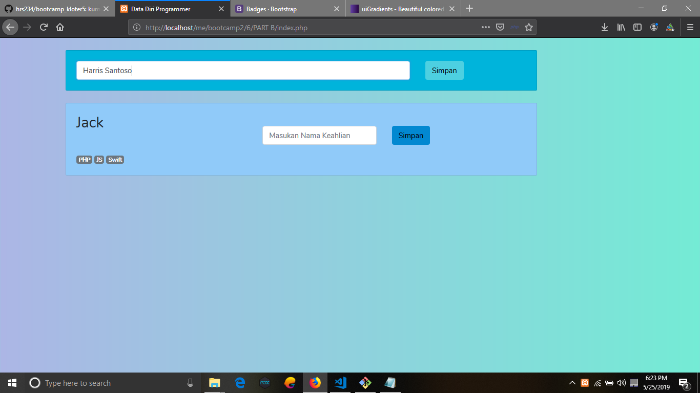
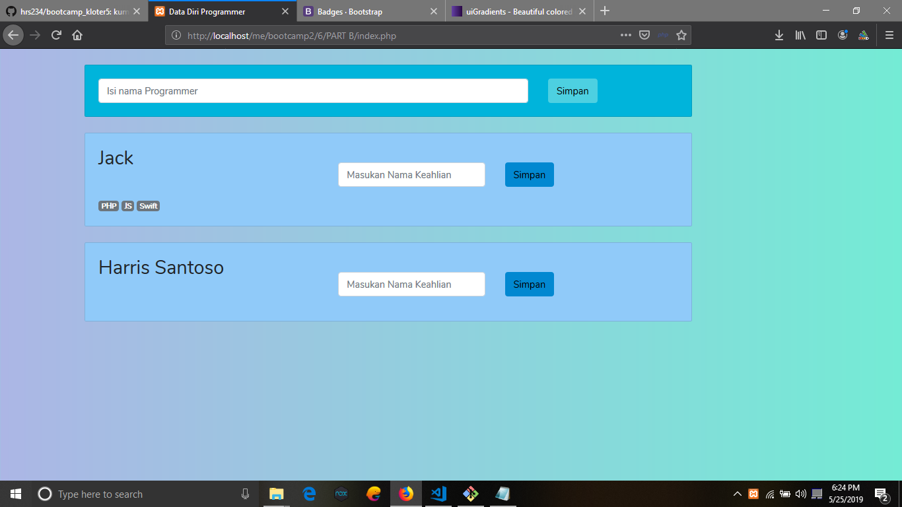
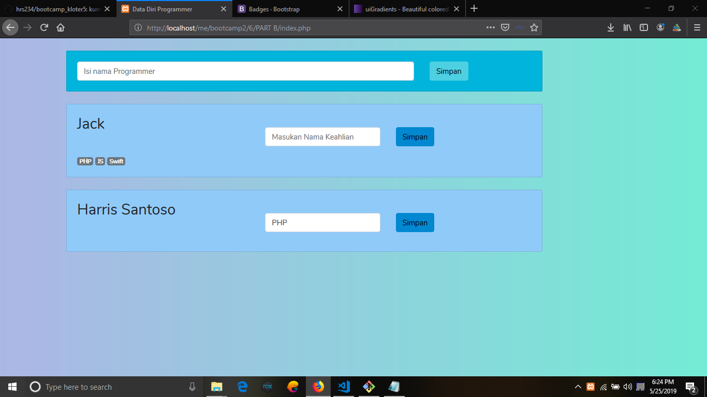
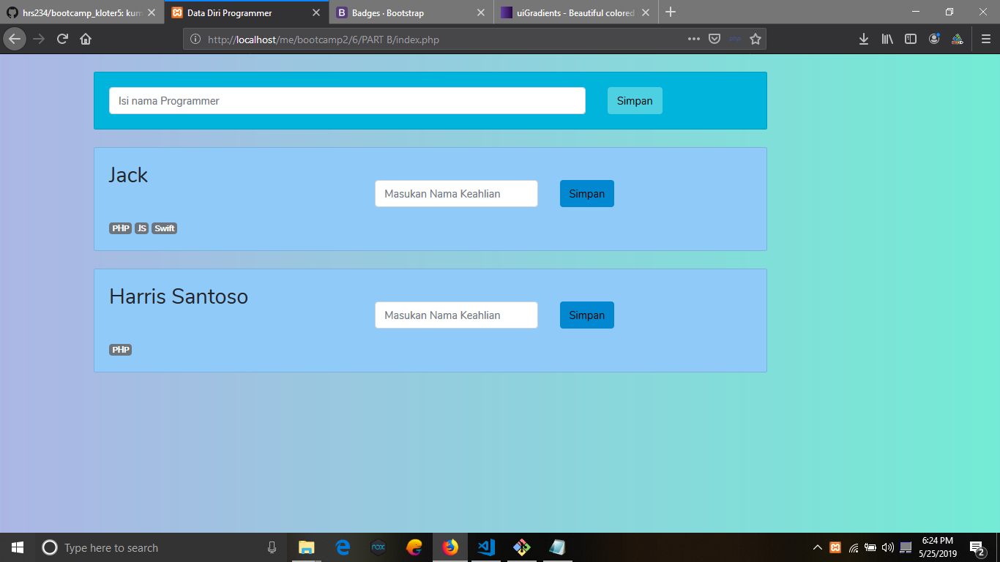

# REST
singkatan dari REpresentational State Transfer atau
transfer keadaan representasi, adalah suatu gaya arsitektur perangkat lunak untuk pendistribusian HTML (_Hyper Text Markup Language_) seperti WWW. REST secara spesifik merujuk pada suatu koleksi prinsip-prinsip jaringan.

# Kegunaan JSON dalam REST

JSON dalam REST berguna untuk merepresentasikan data REST yang nantinya JSON tersebut dibaca oleh program untuk menampilkan data-nya didalam sebuah program yang kita buat

# preview project Soal No.6

Gambar sebelum memasukan nama programmer

Gambar sesudah memasukan nama

Gambar sebelum memasukan nama skill

Gambar sesudah memasukan nama skill